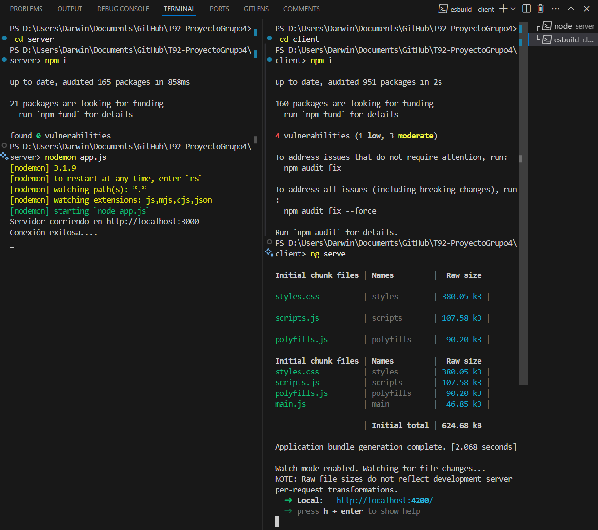

# T92 Proyecto Grupo 4
Proyecto: Sistema de Gestión para un Autolote 
Asignatura: Desarrollo de Aplicaciones Web I

# Pasos para probar el proyecto.

# Requisitos
Este proyecto fue desarrollado con los siguientes componentes, se recomienda la misma versión o superior. 
* Node.js, versión 22.14.0, con versión de NPM 10.9.2
* MySQL community server 8.0.41, administrado Mediante Workbench
* Postman, para poder usar las pruebas de las APIS provistas en la carpeta de collections. 
* Visual Studio Code, para poder examinar el proyecto y levantar los servicios. 
En caso de no tener instalados los componentes, pueden ser descargados desde los siguientes enlaces externos:
* MySQL https://dev.mysql.com/downloads/installer/
* Node.js https://nodejs.org/en/download 
* Angular https://angular.dev/tools/cli/setup-local 
* Postman https://www.postman.com/downloads/ 
* VS Code https://code.visualstudio.com/ 
En el entorno de Microsoft Windows, si la computadora no tenía instalado previamente ninguno de estos componentes, deberá cambiar las políticas de ejecución del sistema, ya que de forma predetermina bloquean la ejecución de scripts, para hacerlo, ejecute la terminal o PowerShell con permisos de administrador, y ejecute el siguiente comando:

``` bash 
Set-ExecutionPolicy -Scope CurrentUser -ExecutionPolicy RemoteSigned
```
# Verificación de requisitos de entorno de desarrollo 
Para verificar que tiene instalado el terno de desarrollo requerido, puedo verificar mediante la terminal ingrese los siguientes comandos:

Node.js
``` bash 
node -v
```
NPM (parte de Node.js)
``` bash 
npm -v
```

Angular
``` bash 
ng version
```
La terminal deberá devolver las versiones de cada herramienta, de una forma similar a esta:


# Verificación de servidor Base de Datos
El servidor de la base de datos debe ser visible al abrir Workbench, de esa manera


Caso contrario, puede referirse a esta guía sobre la correcta instalación del servidor de base de datos  https://youtu.be/MMg8AsHtbYk?si=Hx-29JSyQ_fSCxc1 
# Conexión del proyecto a la base de datos
en la carpeta server, se encuentra un archivo. env, dicho archivo contiene el nombre y contraseña del servidor de base de datos, de manera predeterminada en este proyecto tanto usuario como contraseña se han configurado como root, recuerde modificarlos para que coincidan con su instalación local de base de datos:

DB_HOST=localhost
DB_USER=root // cambie por su nombre de usuario
DB_PASSWORD=root // cambie por su contraseña de mysql
PORT=3000
DB_NAME=autolotedb // nombre de la base de datos provista en el script de creación provisto dentro del repositorio (ver archivo AutoloteDB.sql) 


# Pasos a seguir
* clonar el repositorio
* abrir el proyecto con VS Code
* reinstalar dependencias usando npm install, este proyecto esta divido en 2 carpetas principales: client para el frontend y server para backend, en la carpeta server como client respectivamente, se recomienda abrir dos terminales para ejecutar los scripts necesarios para cada uno
# Backend
increaser a ubicación
``` bash 
cd server
```
Reinstalar dependencias
``` bash 
npm i
```
levantar el servicio 
``` bash 
nodemon app.js
```

# Frontend
increaser a ubicación
``` bash 
cd client
```
Reinstalar dependencias
``` bash 
npm i
```
levantar el servicio 
``` bash 
serve ng
```
Debería verse similar a esto:



El servicio de Angular se carga en http://localhost:4200 , acceda a él desde su navegador web de preferencia 


Ya esta listo para probar el proyecto, como paso final, abra Postman e importe las colleciones que se encuentran en la carpeta collections, 

las API de este proyecto están protegidas por autenticación, por lo que deberá primer crear un usuario usando la api de registro de usuario, y posteriormente iniciar sesión con dicho usuario para poder obtener el token, dicho token debe ser copiado y pegado en la sección de Auth Type > bearer Token, así podrá probar las Apis sin restricciones. 


Recurde al final detener los servicios tanto del client como server usando Ctrl+C en la terminal de ambos. 
